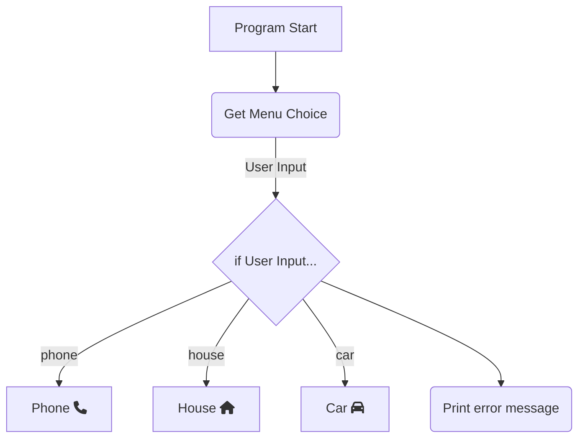

# What is a Logic Diagram? 
A logic diagram is another tool programmers can use to break down the flow of logic in their programs, and plan out their projects. We may provide you logic diagrams alongside a way to interpret them, such as a table outlining what certain shapes or icons mean. There are different standards for logic diagrams in programming and engineering, which try to use similar shaping and structure, however this is not a perfect system. 

If making a logic-diagram of your own, the important things to note are the shapes for:
 - Program entry
 - Conditional-points 
 - Loops
 - Functions

This will allow you to plan out the control flow between and through your program. Consider this program diagram:



We might implement this program like this:

```Python
user_choice = input("Which menu do you want?")

if user_choice == "phone":
    Phone() # Call phone function
elif user_choice == "house":
    House() # Call house function
elif user_choice == "car":
    Car() # Call car function
else:
    print("Please enter one of the following options: car, phone, or house.")
```

We implemented something to collect the menu choice and print the error message, and we used an if-statement on the User's input just like the diagram outlined. More serious programs make this more beneficial however, like consider this diagram:


It's a lot even with the diagram, but it'd be worse if it were just code - even if it were a simplified psuedocode. One would typically use a diagram to outline the overall functionality of a program (specifically the decisions we make throughout the program) and then use psuedocode to plan out the specific details. 

## Links
 - https://www.drawio.com/
